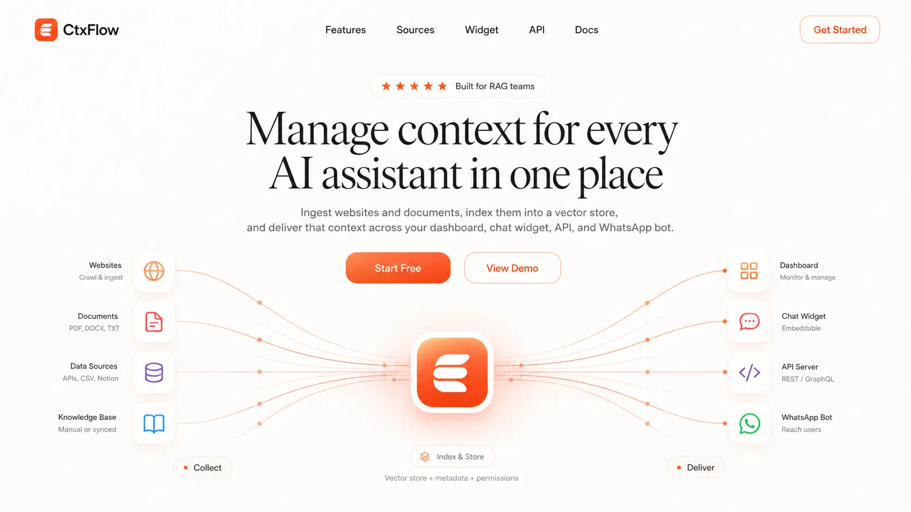

# CtxFlow

CtxFlow es un gestor de contexto para aplicaciones RAG. Ofrece a los equipos un único lugar para recopilar fuentes de conocimiento, indexarlas en un almacén vectorial y exponer ese contexto a través de múltiples interfaces de asistente: un panel de administración, un widget de chat insertable, una aplicación completa de chat, un servidor API y un bot de WhatsApp.

El proyecto está construido como un monorepo Bun/Turborepo con aplicaciones Next.js, una API Hono, routers tRPC, persistencia con Drizzle/PostgreSQL, limitación de tasa (rate limiting) y estado de sesión de WhatsApp respaldados por Redis, y Upstash Vector para la recuperación.

## Qué incluye

- **Gestor de contexto/fuentes**: agregar, listar y eliminar fuentes de conocimiento desde el panel.
- **Ingesta de sitios web**: extraer contenido web con Firecrawl, dividirlo en fragmentos y actualizarlo (upsert) en el índice vectorial.
- **Ingesta de documentos**: cargar archivos PDF, DOC y DOCX, analizarlos, dividirlos en fragmentos y almacenar sus incrustaciones (embeddings) y contenido buscable.
- **Middleware RAG**: reescribe las preguntas del usuario en consultas de recuperación independientes, encuentra fragmentos relevantes e inyecta el contexto en el modelo.
- **Widget de chat**: una interfaz de chat de Next.js diseñada para ejecutarse dentro de un iframe.
- **Script insertable**: un `widget.js` compilado con Vite que puede montar el chat como una burbuja flotante o una sección integrada en otro sitio.
- **Aplicación de chat**: chat de IA autenticado con respuestas en streaming, historial de chat guardado, adjuntos, búsqueda RAG y salida opcional de la herramienta de búsqueda web.
- **Bot de WhatsApp**: verificación de webhook, autenticación OTP por correo electrónico, historial de chat en Redis, soporte para `/clear`, respuestas habilitadas para RAG/búsqueda web y manejo de tipos de mensajes no compatibles.
- **Panel de administración (Admin dashboard)**: gestión de fuentes, revisión de chat de usuarios, revisión de conversaciones de WhatsApp, analíticas básicas y tarjetas de desglose por país.
- **Sistema UI compartido**: componentes basados en shadcn/Radix junto con primitivas de chat de IA.
- **Autenticación y correo electrónico**: integración con Better Auth y plantillas de React Email/Resend.
- **Ganchos de observabilidad**: Sentry, PostHog, Databuddy, registro estructurado y soporte para limitación de tasa están integrados en los paquetes de la aplicación.

## Aplicaciones

| App | Ruta | Propósito |
| --- | --- | --- |
| `web` | `apps/web` | Panel de administración para fuentes, analíticas, revisión de chat y código de inserción del widget. Se ejecuta en el puerto `3001`. |
| `widget` | `apps/widget` | Aplicación de chat orientada al usuario con respuestas de IA en streaming, persistencia de chat, cargas, middleware RAG y búsqueda web. Se ejecuta en el puerto `3002`. |
| `server` | `apps/server` | Servidor API Hono para autenticación, tRPC, cargas, comprobaciones de estado y webhooks de WhatsApp. Se ejecuta en el puerto `3000`. |
| `embed` | `apps/embed` | Paquete Vite que compila el script del widget insertable para sitios externos. |

## Paquetes

| Paquete | Ruta | Propósito |
| --- | --- | --- |
| `@repo/auth` | `packages/auth` | Configuración de Better Auth, exportaciones del cliente de autenticación y asistentes de autenticación por correo. |
| `@repo/db` | `packages/db` | Esquema de Drizzle, cliente de PostgreSQL y scripts de migración de base de datos. |
| `@repo/rpc` | `packages/rpc` | Routers tRPC para gestión de fuentes y analíticas. También maneja Firecrawl, análisis de documentos y asistentes para el almacén vectorial. |
| `@repo/ui` | `packages/ui` | Componentes UI compartidos, estilos globales de Tailwind, hooks y primitivas UI de chat de IA. |
| `@repo/email` | `packages/email` | Plantillas de React Email para enlaces mágicos y correo OTP. |
| `@repo/ratelimit` | `packages/ratelimit` | Utilidades de Upstash Redis y limitador de tasa. |
| `@repo/typescript-config` | `packages/typescript-config` | Configuraciones compartidas de TypeScript para aplicaciones y bibliotecas. |

## Stack principal

- **Entorno de ejecución y workspace**: Bun, Turborepo, TypeScript
- **Aplicaciones web**: Next.js 15, React 19, Tailwind CSS, shadcn/ui, Radix UI
- **API**: Hono, tRPC, Zod
- **IA**: Vercel AI SDK, OpenAI, Groq, Anthropic, Voyage AI
- **RAG**: Firecrawl, divisores/cargadores de texto LangChain, Upstash Vector
- **Almacenamiento**: PostgreSQL, Drizzle ORM, Redis, Vercel Blob
- **Autenticación/correo**: Better Auth, Resend, React Email
- **Analíticas/observabilidad**: PostHog, Databuddy, Sentry, Pino

## Estructura del proyecto

```txt
ctxflow/
├── apps/
│   ├── web/       # Panel de administración y pantalla de código de inserción del widget
│   ├── widget/    # Aplicación de chat que puede ejecutarse de forma independiente o en un iframe
│   ├── server/    # API Hono, servidor tRPC, cargas, bot de WhatsApp
│   └── embed/     # Script de cargador de widget externo
├── packages/
│   ├── auth/      # Better Auth y asistentes de autenticación por correo
│   ├── db/        # Esquema Drizzle, cliente y migraciones
│   ├── email/     # Plantillas React Email
│   ├── ratelimit/ # Redis y limitación de tasa
│   ├── rpc/       # Routers tRPC, ingesta, asistentes de almacén vectorial
│   ├── ui/        # Sistema de diseño compartido y componentes de IA
│   └── typescript-config/
├── docker-compose.yml
├── package.json
└── turbo.json
```

## Primeros pasos

Instalar dependencias:

```bash
bun install
```

Iniciar infraestructura local:

```bash
docker compose up -d
```

Crear archivos de entorno a partir de los ejemplos:

```bash
cp apps/server/.env.example apps/server/.env
cp apps/web/.env.example apps/web/.env
```

Como mínimo, configura PostgreSQL, Better Auth, claves del proveedor de modelos, Redis, Upstash Vector y cualquier integración que planees usar. La configuración local de Docker inicia PostgreSQL en `5432`, Redis en `6379`, un puente HTTP sin servidor para Redis en `8079` y RedisInsight en `5540`.

Aplicar o ejecutar migraciones de base de datos:

```bash
bun run db:push
```

Ejecutar el monorepo en desarrollo:

```bash
bun run dev
```

URLs locales predeterminadas:

- Panel web: `http://localhost:3001`
- Aplicación de chat del widget: `http://localhost:3002`
- Servidor API: `http://localhost:3000`

## Scripts disponibles

- `bun run dev`: iniciar todas las aplicaciones a través de Turborepo
- `bun run build`: compilar todas las aplicaciones/paquetes
- `bun run check-types`: ejecutar comprobaciones de TypeScript en todo el workspace
- `bun run dev:web`: iniciar solo la aplicación del panel
- `bun run dev:widget`: iniciar solo la aplicación de widget/chat
- `bun run dev:server`: iniciar solo el servidor API Hono
- `bun run db:push`: aplicar el esquema de Drizzle a la base de datos
- `bun run db:generate`: generar migraciones de Drizzle
- `bun run db:migrate`: generar y ejecutar migraciones de Drizzle
- `bun run db:studio`: abrir Drizzle Studio

## Insertar el widget de chat

La página de Código del panel muestra el fragmento de inserción. El cargador de inserción actual soporta una burbuja flotante por defecto:

```html
<script type="module" src="https://your-widget-host/widget.js" async></script>
```

También puede configurarse como una sección integrada estableciendo atributos de script utilizados por `apps/embed/src/embed.ts`, como `data-type="section"`, `data-target="#chat"` y `data-height="600px"`.

## Notas

- El README describe intencionalmente la base de código actual. Algunas integraciones requieren variables de entorno que aún no están completamente listadas en los archivos `.env.example` comprometidos.
- La ingesta de documentos actualmente admite PDF, DOC y DOCX desde el panel. La capa RPC rechaza nombres de archivo duplicados, PDFs solo de OCR y PDFs de más de 20 páginas.
- El historial de chat de WhatsApp y el estado OTP se almacenan en Redis. El historial de chat web, usuarios, mensajes, sesiones y fuentes se almacenan en PostgreSQL.
